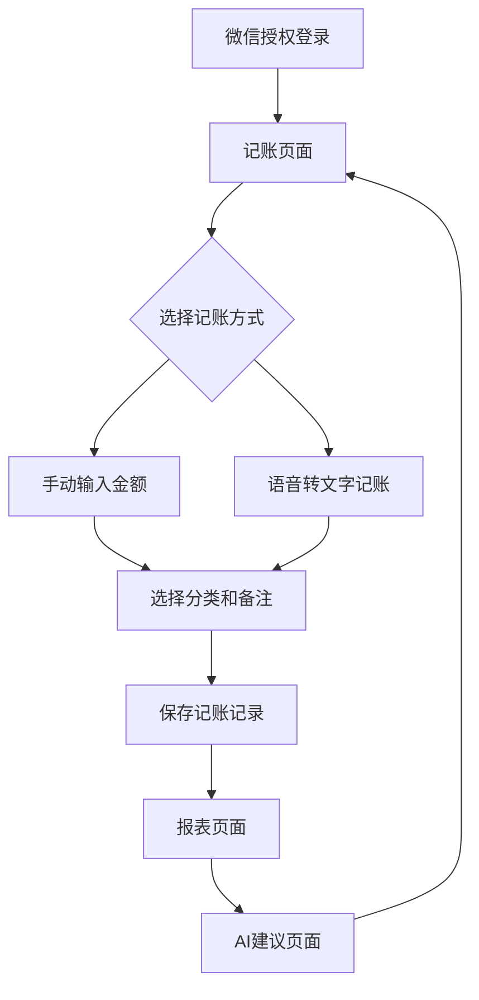

## 1. Product Overview

《记账》微信小程序是一款便捷的个人财务管理工具，帮助用户轻松记录日常收支，通过AI智能分析提供财务建议。用户可以通过手动输入或语音转文字快速记账，系统会自动生成饼图报告并提供个性化的理财建议。

目标用户群体为注重个人财务管理的微信用户，特别是年轻上班族和学生群体，帮助他们培养良好的记账习惯，实现财务透明化。

## 2. Core Features

### 2.1 User Roles

| Role | Registration Method | Core Permissions |
| ---- | ------------------- | ---------------- |
| 普通用户 | 微信授权登录              | 记账、查看报表、获取AI建议   |

### 2.2 Feature Module

记账微信小程序包含以下核心页面：

1. **记账页面**：金额输入、语音记账、分类选择、备注添加
2. **报表页面**：饼图展示、月度统计、分类分析
3. **AI建议页面**：智能分析、个性化建议、理财提醒

### 2.3 Page Details

| Page Name | Module Name | Feature description       |
| --------- | ----------- | ------------------------- |
| 记账页面      | 金额输入模块      | 支持数字键盘输入，自动识别小数点，显示实时金额   |
| 记账页面      | 语音记账模块      | 长按录音按钮，实时语音转文字，智能识别金额和分类  |
| 记账页面      | 分类选择模块      | 提供餐饮、交通、购物等常用分类，支持自定义分类   |
| 记账页面      | 备注添加模块      | 添加详细描述，支持表情符号，限制50字符内     |
| 报表页面      | 饼图展示模块      | 按分类展示支出占比，支持月度切换，颜色区分不同类别 |
| 报表页面      | 统计信息模块      | 显示总收入、总支出、结余，提供同比环比数据     |
| AI建议页面    | 智能分析模块      | 基于记账数据生成消费习惯分析，识别异常支出     |
| AI建议页面    | 建议生成模块      | 提供个性化省钱建议、预算规划、理财推荐       |

## 3. Core Process

用户使用流程：

1. 用户首次使用微信授权登录
2. 进入记账页面，选择手动输入或语音记账
3. 输入金额、选择分类、添加备注后保存
4. 在报表页面查看收支统计和饼图分析
5. 在AI建议页面获取个性化理财建议

## 4. User Interface Design

### 4.1 Design Style

* 主色调：微信绿色 (#07C160) 配白色背景

* 按钮样式：圆角矩形，扁平化设计

* 字体：微信小程序默认字体，主标题16px，正文14px

* 布局风格：卡片式布局，底部导航栏

* 图标风格：线性图标，简洁现代

### 4.2 Page Design Overview

| Page Name | Module Name | UI Elements               |
| --------- | ----------- | ------------------------- |
| 记账页面      | 金额输入区       | 大号数字显示（24px），绿色确认按钮，半透明背景 |
| 记账页面      | 语音按钮        | 中央圆形录音按钮，红色录音状态，波纹动画效果    |
| 记账页面      | 分类选择        | 宫格布局，彩色图标，选中状态高亮显示        |
| 报表页面      | 饼图区域        | 中央大饼图（占屏60%），图例在右侧，支持手势旋转 |
| 报表页面      | 统计卡片        | 三栏式布局，绿色收入、红色支出、蓝色结余      |
| AI建议页面    | 建议卡片        | 轮播卡片设计，每张卡片一个建议，支持滑动切换    |

### 4.3 Responsiveness

采用微信小程序原生适配方案，支持不同屏幕尺寸的手机设备。界面元素使用rpx单位确保自适应，重点优化触摸交互体验，按钮点击区域不小于44x44px。
