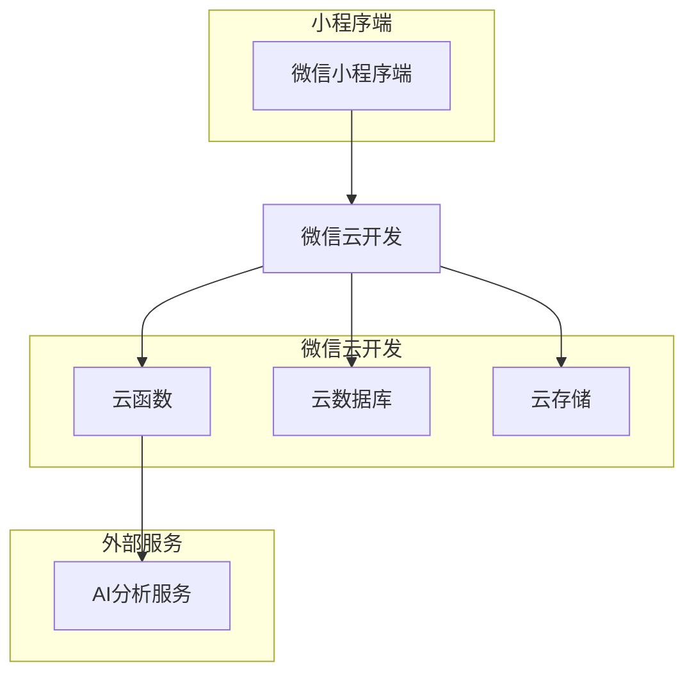
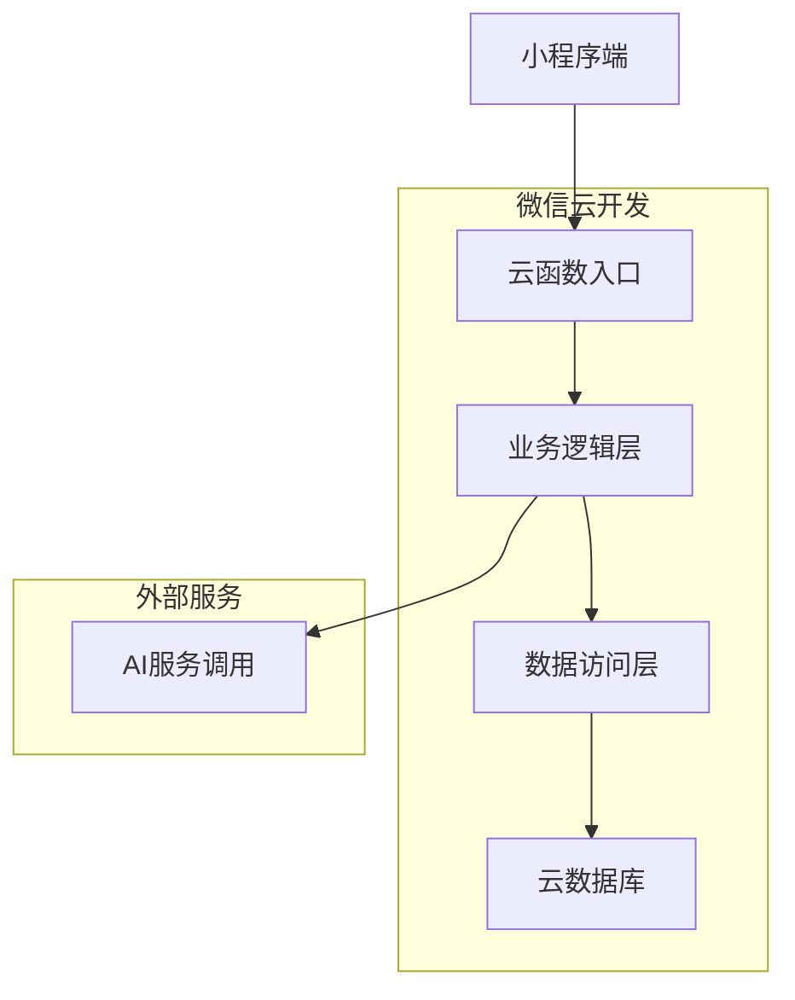
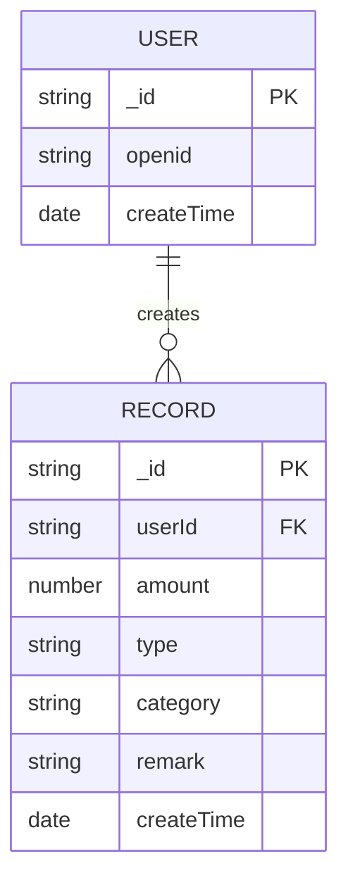

## 1. Architecture design



## 2. Technology Description

- 前端：微信小程序原生框架 + WXML + WXSS + JavaScript
- 后端：微信云开发（云函数、云数据库、云存储）
- AI服务：腾讯云AI接口（语音识别、智能分析）
- 开发工具：微信开发者工具

## 3. Route definitions

| 页面路径 | 用途 |
|---------|------|
| /pages/account/account | 记账页面，提供金额输入、语音记账、分类选择功能 |
| /pages/report/report | 报表页面，展示饼图统计和收支分析 |
| /pages/ai/ai | AI建议页面，提供智能分析和理财建议 |

## 4. API definitions

### 4.1 记账相关API

```
createRecord
```

请求参数：
| 参数名 | 类型 | 必填 | 说明 |
|--------|------|------|------|
| amount | number | 是 | 金额（元） |
| type | string | 是 | 类型：income/expense |
| category | string | 是 | 分类 |
| remark | string | 否 | 备注 |
| date | string | 是 | 日期 |

响应参数：
| 参数名 | 类型 | 说明 |
|--------|------|------|
| _id | string | 记录ID |
| success | boolean | 操作状态 |

### 4.2 报表统计API

```
getReportData
```

请求参数：
| 参数名 | 类型 | 必填 | 说明 |
|--------|------|------|------|
| month | string | 是 | 月份（YYYY-MM） |

响应参数：
| 参数名 | 类型 | 说明 |
|--------|------|------|
| totalIncome | number | 总收入 |
| totalExpense | number | 总支出 |
| balance | number | 结余 |
| categoryData | array | 分类统计数据 |

### 4.3 语音识别API

```
speechToText
```

请求参数：
| 参数名 | 类型 | 必填 | 说明 |
|--------|------|------|------|
| audioFile | file | 是 | 音频文件 |

响应参数：
| 参数名 | 类型 | 说明 |
|--------|------|------|
| text | string | 识别文本 |
| amount | number | 识别金额 |
| category | string | 识别分类 |

## 5. Server architecture diagram



## 6. Data model

### 6.1 数据模型定义



### 6.2 数据定义语言

记账记录表（records）
```javascript
// 云数据库集合定义
{
  "_id": "自动生成",
  "userId": "用户ID",
  "amount": "金额",
  "type": "类型：income/expense",
  "category": "分类",
  "remark": "备注",
  "createTime": "创建时间"
}

// 索引定义
{
  "userId": 1,
  "createTime": -1
}
```

用户表（users）
```javascript
// 云数据库集合定义
{
  "_id": "自动生成",
  "openid": "微信openid",
  "createTime": "创建时间"
}
```

### 6.3 云开发权限配置

```javascript
// 记账记录权限
{
  "read": true,  // 用户只能读取自己的记录
  "write": true  // 用户只能写入自己的记录
}

// 用户权限
{
  "read": true,  // 用户只能读取自己的信息
  "write": false // 用户信息不可修改
}
```